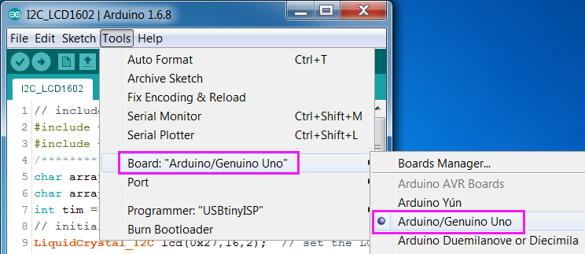
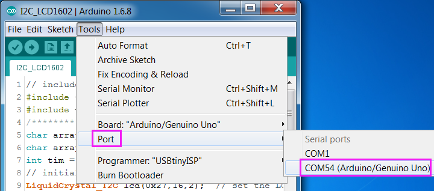
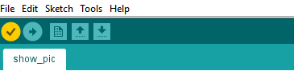
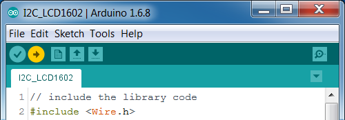

# Examples
This page show you the examples provided with RGB Matrix.

> Please make sure you have successfully loaded the library file into the Arduino IDE, as shown in [setup](setup_arduino).

> For the basic knowledge of Arduino, please refer to [HERE](https://www.arduino.cc/en/Tutorial/Foundations).

Quick Links：
* [Run the sketch](#1)
* [Show color](#2)
* [Show picture](#3)
* [More detail](#4)

## Run the sketch

1. Open the example sketch (in the folder *RGB_Matrix_lib\Arduino\example*).   
2. Select the Board and Port.  
  
  
3. Compile.  
  

4. Upload.  
   
 

## Example 1 - Show color

In this example we can make RGB Matrix display any color.

## Example 2 - Show picture

In this example we can make the RGB Matrix display 19 preset graphics one by one.

## More Detail

Check the [API File](sled_func.md).