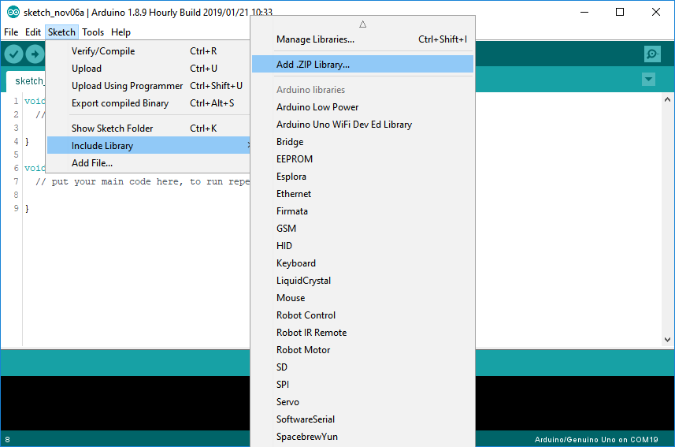
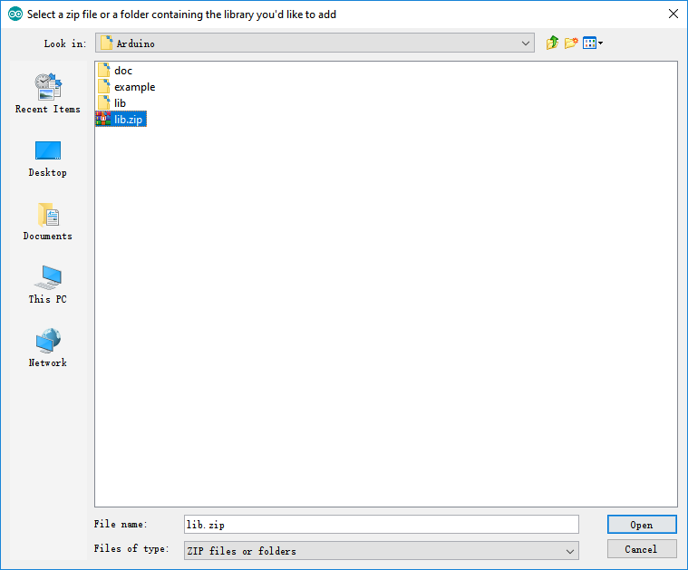
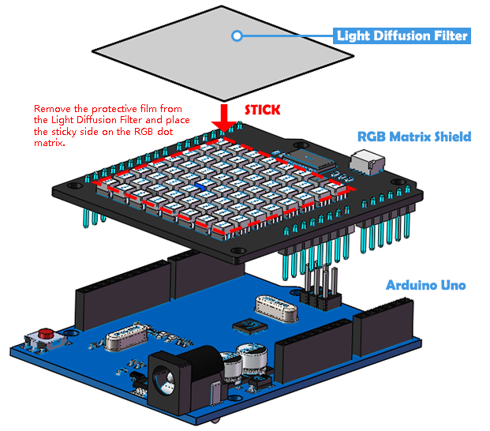

# Setup the Arduino

Quick Links：
* [Tool needed](#1)
* [Setup](#2)
    *   [Install Arduino IDE](#21)
    *   [Download the Files](#22)
    *   [Include Library](#23)
    *   [Assemble the Shield](#24)

## Tools needed

Please prepare the following tools:

* Arduino UNO
* USB Cable Type A/B
* Personal Computer

The APP you have to prepare:

* [Arduino IDE](https://www.arduino.cc/en/software)

## Setup

### Install Arduino IDE
* For Windows OS user, please click [HERE](https://support.arduino.cc/hc/en-us/articles/360013825219-How-to-install-the-Arduino-IDE-on-Windows-PCs).  
* For Mac OS user, please click [HERE](https://support.arduino.cc/hc/en-us/articles/360013751960-How-to-install-Arduino-IDE-in-MAC-OS).  
* For Linux OS user, please click [HERE](https://support.arduino.cc/hc/en-us/articles/360013825199-How-to-install-the-Arduino-IDE-in-linux).

-----

### Download the Files

Go to [This page](https://github.com/sunfounder/rgb_matrix) download the files.  

-----

### Install a Library

In order to use the RGB Matrix shield, you need to load the library as follows.

In the Arduino IDE, navigate to Sketch > Include Library > Add .ZIP Library. At the top of the drop down list, select the option to "Add .ZIP Library''.  

You will be prompted to select the library you would like to add. Here we find **lib.zip** (In the *RGB_Matrix_lib\Arduino* in the folder you just downloaded) . Navigate to the .zip file's location and open it.

Return to the Sketch > Include Library menu. menu. You should now see the library at the bottom of the drop-down menu. It is ready to be used in your sketch. The zip file will have been expanded in the libraries folder in your Arduino sketches directory.

>The Library will be available to use in sketches, but with older IDE versions examples for the library will not be exposed in the File > Examples until after the IDE has restarted.

>For more information on installing the library, please see [HERE](https://www.arduino.cc/en/Guide/Libraries).

-----

### Assemble the Shield

Now,you can run [examples](examples_arduino.md).