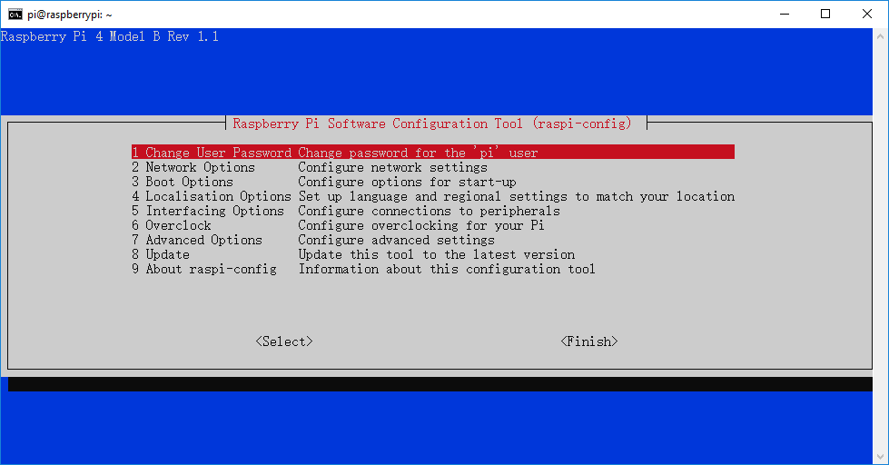
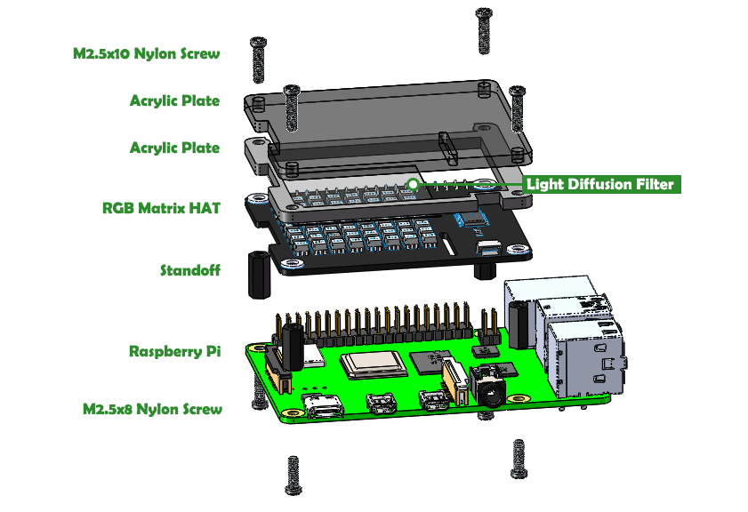

# Setup the Raspberry Pi

Quick Links：
* [Tool needed](#1)
* [Setup](#2)
    *   [Setup Raspberry Pi OS](#21)
    *   [Setup the wireless network](#22)
    *   [Remote Access by SSH](#23)
    *   [Enable I2C](#24)  
    *   [Assemble the RGB Matrix HAT](#25)  

<a id="1"></a>
## Tools needed

Please prepare the following tools:

* Your own Raspberry Pi
* Micro SD card
* Card Reader
* Personal Computer

The APP you have to prepare:

* [Raspberry Pi Imager](https://www.raspberrypi.org/downloads/)

<a id="2"></a>

## Setup
<a id="21"></a>

### Step1 - Setup Raspberry Pi OS
1. Insert the SD card (with card reader) into the PC.
2. Run Raspberry Pi Imager.


>For more ways to install Raspberry Pi OS, please click [Here](https://www.raspberrypi.org/documentation/installation/).


-----
<a id="22"></a>
### Step2 - Setup the wireless network
You will need to define a **wpa_supplicant.conf** file for your particular wireless network. Put this file in the **boot** folder, and when the Pi first boots, it will copy that file into the correct location in the Linux root file system and use those settings to start up wireless networking. 

Depending on the OS and editor you are creating this on, the file could have incorrect newlines or the wrong file extension so make sure you use an editor that accounts for this. 

Linux expects the line feed (LF) newline character. For more information, see this [Wikipedia article](https://en.wikipedia.org/wiki/Newline).

**wpa_supplicant.conf** file example:
```
ctrl_interface=DIR=/var/run/wpa_supplicant GROUP=netdev  
update_config=1  
country=<Insert 2 letter ISO 3166-1 country code here>

network={
 ssid="<Name of your wireless LAN>" 
 psk="< Password for your wireless LAN>"  
}
```

>More information on the **wpa_supplicant.conf** file can be found [HERE](https://www.raspberrypi.org/documentation/configuration/wireless/wireless-cli.md). 

>See [Wikipedia](https://en.wikipedia.org/wiki/ISO_3166-1) for a list of 2 letter ISO 3166-1 country codes.

>Note that some older wireless dongles don't support 5GHz networks.

>For more ways to set up a wireless network, please click [HERE](https://www.raspberrypi.org/documentation/configuration/wireless/README.md)。

-----
<a id="23"></a>
### Step3 - Remote Access by SSH

#### 1. Enable SSH  

You can access the command line of a Raspberry Pi remotely from another computer or device on the same network using SSH.  

The Raspberry Pi will act as a remote device: you can connect to it using a client on another machine.  In this way, you only have access to the command line, not the full desktop environment.

SSH can be enabled by placing a file named **ssh**, without any extension, onto the **boot** partition of the SD card from another computer. When the Pi boots, it looks for the ssh file. If it is found, SSH is enabled and the file is deleted. The content of the file does not matter; it could contain text, or nothing at all.


If you have loaded Raspberry Pi OS onto a blank SD card, you will have two partitions. The first one, which is the smaller one, is the boot partition. Place the file into this one.


Then insert the SD card into Raspberry Pi.

#### 2. Find the IP address

Any device connected to a Local Area Network is assigned an IP address.
In order to connect to your Raspberry Pi from another machine using SSH, you need to know the Pi's IP address. 

On Raspberry Pi OS, **multicast DNS** is supported out-of-the-box by the Avahi service.

If your device supports mDNS, you can reach your Raspberry Pi by using its `hostname` and the `.local` suffix. The default hostname on a fresh Raspberry Pi OS install is `raspberrypi`, so by default any Raspberry Pi running Raspberry Pi OS responds to:

```
ping raspberrypi.local
```
<!---->  


If the Raspberry Pi is reachable, ping will show its IP address:

```
Pinging raspberrypi.local [192.168.18.168] with 32 bytes of data:
Reply from 192.168.18.168: bytes=32 time=54ms TTL=64
Reply from 192.168.18.168: bytes=32 time=1ms TTL=64
Reply from 192.168.18.168: bytes=32 time=1ms TTL=64
Reply from 192.168.18.168: bytes=32 time=2ms TTL=64

Ping statistics for 192.168.18.168:
    Packets: Sent = 4, Received = 4, Lost = 0 (0% loss),
Approximate round trip times in milli-seconds:
    Minimum = 1ms, Maximum = 54ms, Average = 14ms
```
>For more ways to find the IP address, please click [HERE](https://www.raspberrypi.org/documentation/remote-access/ip-address.md).


#### 3. Remote Access

You can use SSH to connect to your Raspberry Pi from a **Windows 10** computer that is using *October 2018 Update or later* without having to use third-party clients.

> For use SSH from a Linux computer, or a Mac, please click [HERE](https://www.raspberrypi.org/documentation/remote-access/ssh/unix.md).

> For older version of Windows, please click [Here](https://www.raspberrypi.org/documentation/remote-access/ssh/windows.md).

To connect to your Pi from a different computer, copy and paste the following command into the terminal window, but replace `<IP>` with the IP address of the Raspberry Pi.

```
ssh pi@<IP>
```


When the connection works you will see a security/authenticity warning. Type `yes` to continue. You will only see this warning the first time you connect.


>In the event that your Pi has taken the IP address of a device to which your computer has connected before (even if this was on another network), you may be given a warning and asked to clear the record from your list of known devices. Following this instruction and trying the `ssh` command again should be successful.

Next you will be prompted for the password for the user as which you are trying to connect: the default password for the pi user on Raspberry Pi OS is  `raspberry`.

>When you input the password, the characters do not display on window accordingly, which is normal. What you need is to input the correct passcode.

>For security reasons it is highly recommended to change the default password on the Raspberry Pi. You should now be able to see the Raspberry Pi prompt, which will be identical to the one found on the Raspberry Pi itself.


You are now connected to the Raspberry Pi remotely, and can execute commands.

-----
<a id="24"></a>

### Step4 - Enable I2C

To play RBG Matrix，you have to enable I2C interfaces and automatic loading of the I2C kernel module.

Run the following from the command line to open the configuration tool：
```
sudo raspi-config
```
>The `sudo` is required because you will be changing files that you do not own as the` pi` user

You should see a blue screen with options in a grey box in the centre, like so:



Go to setting `5 Interface Options` > `P5 I2C`, and press `<YES>` and `<OK>` to enable it.

At last, `<finish>`.

-----
<a id="25"></a>
### Step5 - Assemble the RGB Matrix HAT



Now,you can run [examples](examples_rpi).