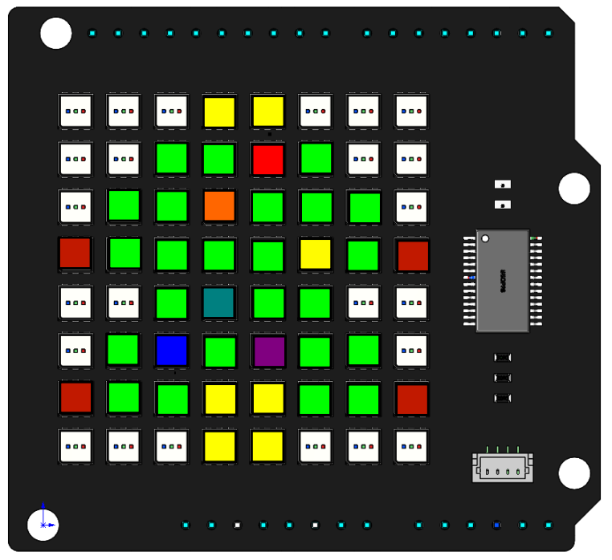

Christmas Tree
===================

In this project, we will use the ``draw_point()`` function to make a colorful Christmas tree.

**Code**

When the program runs, you will see a shiny Christmas tree appear on the RGB Matrix Shield.

.. raw:: html

  <iframe src=https://create.arduino.cc/editor/sunfounder01/7288c7ff-b2fa-4fd1-bf6e-5a346bd7a995/preview?embed style="height:510px;width:100%;margin:10px 0" frameborder=0></iframe>
  
**How it works?**

.. code-block:: arduino

    byte green[][2] = {{2,1},{3,1},{5,1},
                   {1,2},{2,2},{4,2},{5,2},{6,2},
                   {1,3},{2,3},{3,3},{4,3},{6,3},
                   {2,4},{4,4},{5,4},
                   {1,5},{3,5},{5,5},{6,5},
                   {1,6},{2,6},{5,6},{6,6}};  

    byte flash[][2] = {{4,1},{3,2},{5,3},{3,4},{2,5},{4,5}};
    byte red[][2] = {{0,3},{7,3},{0,6},{7,6}};
    byte yellow[][2] = {{3,0},{4,0},{3,6},{4,6},{3,7},{4,7}};
    byte color[7][3] = {{255,0,0},
                    {255,102,0},
                    {255,255,0},
                    {0,255,0},
                    {0,128,128},
                    {0,0,255},
                    {128,0,128}}; 
	
The Christmas tree is divided into four parts, the red part, the yellow part, the green part, and the blinking part, so we define four arrays to store these coordinates.
The array ``color[7][3]`` stores the 7 colors from which the blinking color will be selected.

.. code-block:: arduino

    void setup() {
      // put your setup code here, to run once:
      RGBMatrixInit();
      tree();
    }

    void loop() {
      // put your main code here, to run repeatedly:
      dot();
    }

Call the ``tree()`` function in ``setup()`` to draw the red, yellow and green parts of the Christmas tree.
Call the ``dot()`` function in ``loop()`` to make the Christmas tree blink.      

.. code-block:: arduino

    void tree() {
    int lenTotal_green = sizeof(green) / sizeof(byte);
    int lenLow_green = sizeof(green[0]) / sizeof(byte);
    int lenHigh_green = lenTotal_green / lenLow_green;
    for (int i = 0; i < lenHigh_green; i++) {
        draw_point(green[i], 0, 255, 0);
    }
    ...

The ``tree()`` function is used to display the red, yellow and green parts of the Christmas tree on the RGB matrix shield using the ``draw_point()`` function.

``sizeof()`` is an operator that returns the number of bytes a type occupies in memory.
* Divide the bytes occupied by the entire two-dimensional array by the bytes occupied by its data type to get the total number of elements. 
* Divide the bytes occupied by the first one-dimensional array by the bytes occupied by its data type to get the number of elements of each one-dimensional array.
* Finally, divide the total number of elements by the number of elements in the 1D array to get the number of 1D arrays, i.e. the number of coordinate points.

For example, `lenHigh_green` is calculated as 24, which is the number of elements in the `green[][2]` array. Then a ``for`` loop is used to traverse `green[][2]` to draw the dots and fill those dots with green. 

The red and yellow parts are also implemented in the same way.

.. code-block:: arduino

    int i = 0
    void dot(){
      int lenTotal_coor = sizeof(coor) / sizeof(byte);
      int lenLow_coor = sizeof(coor[0]) / sizeof(byte);
      int lenHigh_coor = lenTotal_coor / lenLow_coor;  
      for (int j=0; j<lenHigh_coor; j++){
        draw_point(coor[j],color[i][0],color[i][1],color[i][2]);
        i++;
        if (i == 7){
          i = 0;  
        }
      }
      image();  
      delay(200);  
    } 

The ``dot()`` function fills the six points in ``flash[][2]`` with seven different colors in order, the colors are chosen from the array ``color[7][3]``, for example
``{color[0][0],color[0][1],color[0][2]}`` means red ``{255, 0, 0}``. The ``dot()`` function can be called in a loop to achieve the blinking effect.