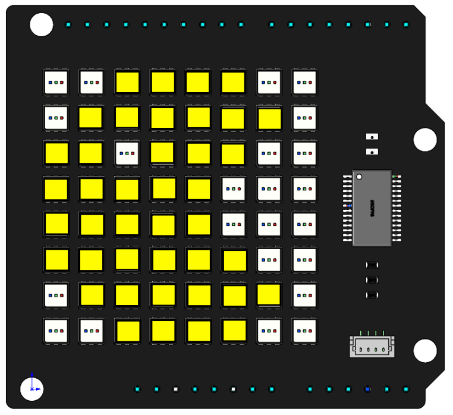
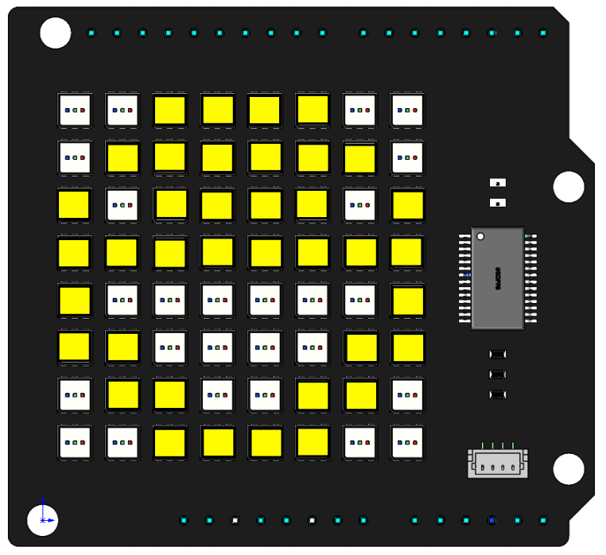

Custom Dynamic Shape
======================

Now, based on the previous project, make several patterns display more consistently.

**Code**

When the program runs, Pac-Man will move to the right, then it will stop and turn its head to smile at you, and finally continue to move to the right.

.. raw:: html

  <iframe src=https://create.arduino.cc/editor/sunfounder01/b884706f-88e1-4e02-86f7-6df571176ef7/preview?embed style="height:510px;width:100%;margin:10px 0" frameborder=0></iframe>

**How it works?**

.. code-block:: arduino

    byte pacman[]={0x3c,0x7e,0xdc,0xf8,0xf8,0xfc,0x7e,0x3c};
    byte pacman2[]={0x3c,0x7e,0xdf,0xff,0xf8,0xff,0x7e,0x3c};
    byte rotate[]={0x3c,0x7e,0xde,0xff,0xc0,0xff,0x7e,0x3c};
    byte normal[]={0x3c,0x7e,0xbd,0xff,0x81,0xff,0x7e,0x3c};
    byte smile[]={0x3c,0x7e,0xbd,0xff,0x81,0xe7,0x7e,0x3c};
    byte smile2[]={0x3c,0x7e,0xbd,0xff,0x81,0xc3,0x66,0x3c};
	
Define six hexadecimal arrays to store the patterns of the actions Pac-Man will do.

.. code-block:: arduino

    void moving_pacman(){
      for(int i=-7; i<2; i++){
        ShowHex(pacman,255,255,0,i);
        delay(200);
        i++;
        ShowHex(pacman2,255,255,0,i);  
        delay(200);
      }
      ShowHex(pacman2,255,255,0,1);
      delay(800);      
    }

The moving_pacman() function is used to display the open-mouth state (``pacman[]``) and the closed state (``pacman2[]``) of Pac-man alternately and move from the left side to the right side, finally displaying the closed state (``pacman2[]``).

The fourth parameter of ``ShowHex()`` can determine the position of the pattern on the RGB Matrix Shield.
So use a ``for`` loop to make Pac-Man appear in the position ``i=-7`` to ``i=1`` to achieve the effect of moving.

.. code-block:: arduino

  void smile_man(){
    ShowHex(normal,255,255,0);
    delay(100);
    for(int i=0; i<4; i++){
      ShowHex(smile,255,255,0);
      delay(200);   
      ShowHex(smile2,255,255,0);
      delay(200);    
    }
    ShowHex(smile,255,255,0);
    delay(100);
    ShowHex(normal,255,255,0);
    delay(200);     
  }

Define a ``smile_man()`` function to realize the actions of Pac-Man to laugh.

.. code-block:: arduino

  void moving_pacman2(){
    for(int i=1; i<8; i++){
      ShowHex(pacman,255,255,0,i);
      delay(100);
      i++;
      ShowHex(pacman2,255,255,0,i);  
      delay(100);
    }     
  }

The ``moving_pacman2()`` function is used to show the actions of continuing to move after a laugh.