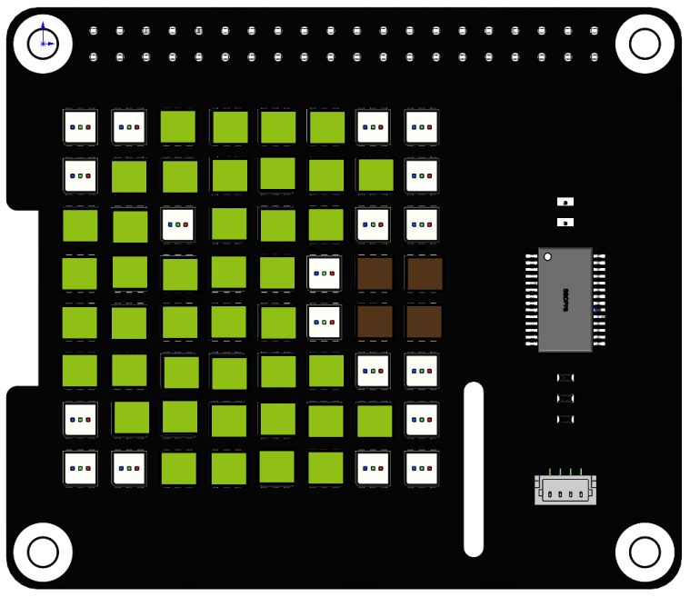
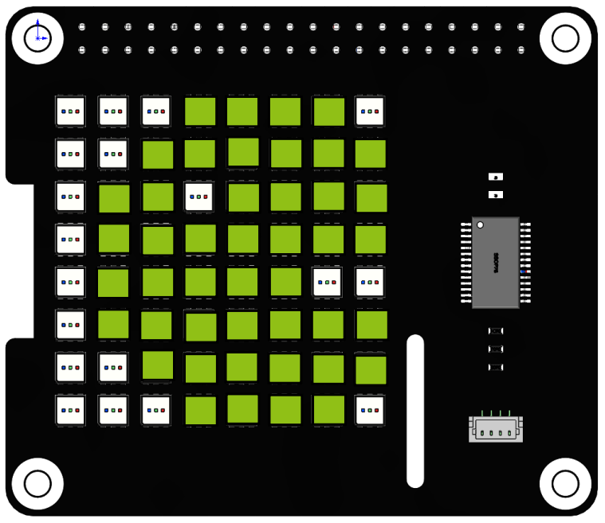

Custom Dynamic Shape
======================

Here, based on the previous project, a continuous animation of Pac-Man eating dots will be created.

**Run the code**

When the program is running, you will see Pac-Man on the RGB matrix cap move from left to right and leave after eating the rightmost dot.

.. raw:: html

    <run></run>

.. code-block::

    cd /home/pi/rgb_matrix/raspberrypi
    sudo python3 custom_dynamic_shape.py  

**Code**

.. note::
    You can **Modify/Reset/Copy/Run/Stop** the code below. But before that, you need to go to source code path like ``rgb_matrix/raspberrypi``. After modifying the code, you can run it directly to see the effect.

.. raw:: html

    <run></run>

.. code-block:: python

    from rgb_matrix import RGB_Matrix
    import time
    import random

    def pacman(a,k):
        
        list2 = [[a-4,0,a-1,0],
                [a-5,1,a,1],
                [a-6,2,a-5,2],
                [a-3,2,a-1,2],
                [a-6,3,a-2,3],
                [a-6,4,a-2,4],
                [a-6,5,a-1,5],
                [a-5,6,a,6],
                [a-4,7,a-1,7]]	
                        
        fill = (144,192,22)      	
        for i in range(0,k+1):
            for j in list2:	
                rr.draw_line(j,fill)
                
            rr.display()

            for j in list2:	
                rr.draw_line(j,fill=(0,0,0))		
            
            for i in range(0,9):
                list2[i][0] += 1
                list2[i][2] += 1
                    
            time.sleep(0.1)		

    def pacman2():

        rr.draw_rectangle(rectangle_coor,fill=(0,0,0))
        
        list = [[2,0,5,0],
                [1,1,6,1],
                [0,2,1,2],
                [3,2,7,2],
                [0,3,7,3],
                [0,4,3,4],
                [0,5,7,5],
                [1,6,6,6],
                [2,7,5,7]]
    
        fill = (144,192,22)
        for i in list:		
            rr.draw_line(i,fill)
                
        rr.display()
        time.sleep(0.1)
            
        rr.draw_rectangle(rectangle_coor,fill=(0,0,0))
                        
    def pac():
        
        coor = [6,3,7,4]	
        rr.draw_rectangle(coor,fill=(82,52,25))
                        
    if __name__ == "__main__":
        rr = RGB_Matrix(0X74)

        rectangle_coor = [0,0,7,7]
        
        while True:
            pac()
            pacman(0,6)	
            pacman2()
            pacman(6,7)

**How it works?**

.. code-block:: python

    while True:
        pac()
        pacman(0,6)	
        pacman2()
        pacman(6,7)

We can disassemble Pac-Man into three actions, ``pac()`` represents the position of the dot.

* ``pacman(0,6)`` means that Pac-Man moves from the far left to the side of the dot.
* ``pacman2()`` mouth closed to indicate the action of eating.
* ``pacman(6,7)`` indicates to continue to leave after eating.

.. code-block:: python

    def pacman(a,k):
        
        list2 = [[a-4,0,a-1,0],
                [a-5,1,a,1],
                [a-6,2,a-5,2],
                [a-3,2,a-1,2],
                [a-6,3,a-2,3],
                [a-6,4,a-2,4],
                [a-6,5,a-1,5],
                [a-5,6,a,6],
                [a-4,7,a-1,7]]	
                        
        fill = (144,192,22)      	
        for i in range(0,k+1):
            for j in list2:	
                rr.draw_line(j,fill)
                
            rr.display()

            for j in list2:	
                rr.draw_line(j,fill=(0,0,0))		
            
            for i in range(0,9):
                list2[i][0] += 1
                list2[i][2] += 1
                    
            time.sleep(0.1)		
                        
The ``pacman()`` function is used to make Pac-man move from the left to the right in an open-mouthed state until it disappears. It has two parameters ``a`` and ``k``, ``a`` represents the starting position of Pac-man and ``k`` represents the number of squares moved to the right.

* ``list2`` stores the coordinates of Pac-man's open-mouth state, drawn as lines, with the x-coordinate of each line determined by ``a``.
* Define a two-level for loop. The inner loop does three things: draws Pac-Man, moves each line in ``list2`` one square to the right, and removes the movement.
* The outer layer repeats the loop ``k`` times, which means Pac-Man moves ``k`` squares to the right.
