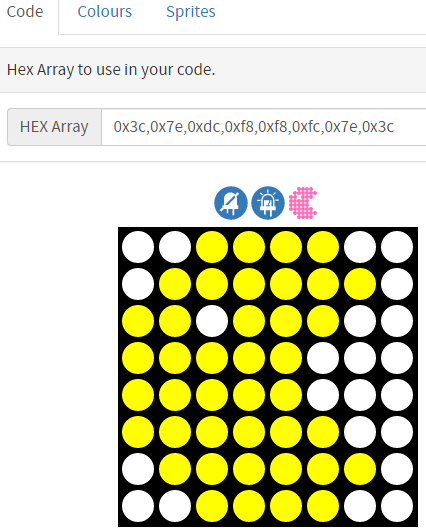
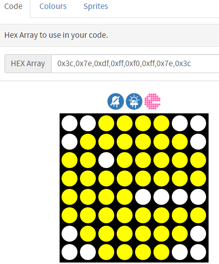

Custom Shape
================

To draw interesting patterns on RGB Matrix Shield, we define ``ShowHex()`` function to facilitate drawing custom patterns.

First you should get the hexadecimal array of the pattern. It is recommended to use the `LED Matrix tool <https://gurgleapps.com/tools/matrix#tp-color>`_, which can be used to design fonts or images for the RGB matrix, and you can also adjust it based on the original pattern. 

You can select the corresponding character or pattern in the **Sprites** page, then set a specific color in the **Colour** page, and finally get the HEX array of that pattern or character from the **Code** page.

For example, we get two HEX arrays of Pac-Man.

**Code**

When the program runs, you will see two Pac-Man pictures are constantly switching.

.. raw:: html

  <iframe src=https://create.arduino.cc/editor/sunfounder01/3357c570-810a-45e8-8672-60540b23e0b7/preview?embed style="height:510px;width:100%;margin:10px 0" frameborder=0></iframe>

**How it works?**

.. code-block:: arduino

    void loop() {
    // put your main code here, to run repeatedly:
    ShowHex(pacman,255,255,0);
    delay(1000);
    ShowHex(pacman2,255,255,0,1);
    delay(1000);   
    }

The main logic is to draw the pattern corresponding to ``pacman[]``, after a delay of 1s, move one square to the right to draw the pattern corresponding to ``pacman2[]``, cyclically.
The fifth parameter in ``ShowHex()`` is used to determine the position of the pattern in the RGB Matrix Shield. For example, 0 is in the middle, and 1 is one square to the right.	

