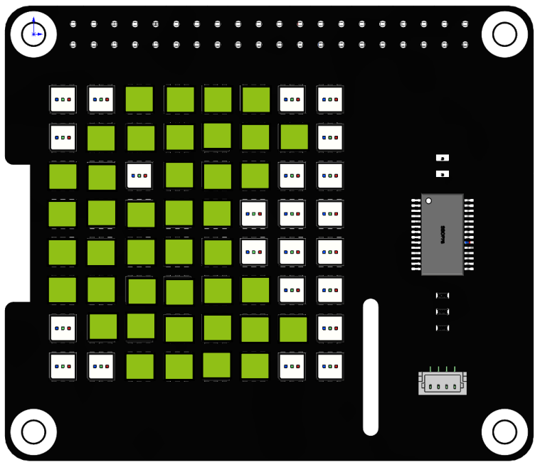
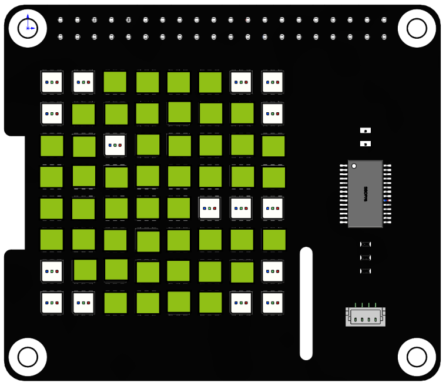

Custom Shape
===============

In the previous project, we made a Christmas tree with point coordinates. In this project, we used straight lines to piece together a pattern of Pac-Man.

**Run the code**

When the program runs, you will see a Pac-Man appearing on the RGB Matrix HAT, and its mouth is continuously opening and closing.

.. raw:: html

    <run></run>

.. code-block::

    cd /home/pi/rgb_matrix/raspberrypi
    sudo python3 custom_shape.py  

**Code**

.. note::
    You can **Modify/Reset/Copy/Run/Stop** the code below. But before that, you need to go to source code path like ``rgb_matrix/raspberrypi``. After modifying the code, you can run it directly to see the effect.

.. raw:: html

    <run></run>

.. code-block:: python

    from rgb_matrix import RGB_Matrix
    import time
    import random

    def pacman():

        rectangle_coor = [0,0,7,7]
                
        list = [[2,0,5,0],
                [1,1,6,1],
                [0,2,1,2],
                [3,2,5,2],
                [0,3,4,3],
                [0,4,4,4],
                [0,5,5,5],
                [1,6,6,6],
                [2,7,5,7]]		
                
        fill = (144,192,22)
        for i in list:		
            rr.draw_line(i,fill)
                
        rr.display()
        time.sleep(1)
            
        rr.draw_rectangle(rectangle_coor,fill=(0,0,0))       		
                
    def pacman2():

        rectangle_coor = [0,0,7,7]

        list = [[2,0,5,0],
                [1,1,6,1],
                [0,2,1,2],
                [3,2,7,2],			
                [0,3,7,3],
                [0,4,3,4],
                [0,5,7,5],
                [1,6,6,6],
                [2,7,5,7]]
                    
        fill = (144,192,22)
        for i in list:		
            rr.draw_line(i,fill)
                
        rr.display()
        time.sleep(1)
            
        rr.draw_rectangle(rectangle_coor,fill=(0,0,0))       		   	  
            
    if __name__ == "__main__":
        rr = RGB_Matrix(0X74)

        rectangle_coor = [0,0,7,7]
        
        while True:
            pacman()
            time.sleep(0.5)
            pacman2()

**How it works?**

.. code-block:: python

    def pacman():

        rectangle_coor = [0,0,7,7]
                
        list = [[2,0,5,0],
                [1,1,6,1],
                [0,2,1,2],
                [3,2,5,2],
                [0,3,4,3],
                [0,4,4,4],
                [0,5,5,5],
                [1,6,6,6],
                [2,7,5,7]]

.. code-block:: python

    def pacman2():

        rectangle_coor = [0,0,7,7]

        list = [[2,0,5,0],
                [1,1,6,1],
                [0,2,1,2],
                [3,2,7,2],			
                [0,3,7,3],
                [0,4,3,4],
                [0,5,7,5],
                [1,6,6,6],
                [2,7,5,7]]

Define two functions ``pacman()`` and ``pacman2()`` to represent the two states of Pac-Man. These two states are composed of many lines, and two lists are defined to store the starting and ending coordinates of these lines respectively. ``rectangle_coor`` represents the entire RGB matrix HAT, which can be used to clear the screen.

.. code-block:: python

    fill = (144,192,22)       	
    for i in list:		
        rr.draw_line(i,fill)
			
    rr.display()
    time.sleep(1)
		
    rr.draw_rectangle(rectangle_coor,fill=(0,0,0))

The above code exists in both functions ``pacman()`` and ``pacman2()`` and is used to display the 2 states of Pac-Man in yellow in the RGB Matrix HAT and then clear the screen.

.. code-block:: python

    while True:
        pacman()
        time.sleep(0.5)
        pacman2()

Call ``pacman()`` and ``pacman2()`` cyclically to increase the dynamic effect of Pac-Man.

You can also imagine other more interesting patterns, this `website <https://gurgleapps.com/tools/matrix#tp-color>`_ may be able to get some references.

