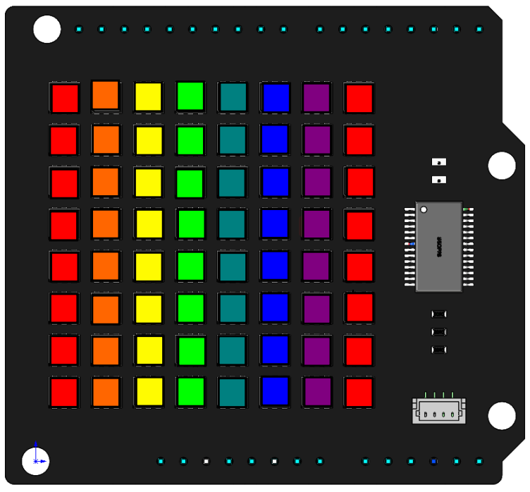

Dazzling Light 
================

In the previous project, we learned to use some simple functions to make RGB Matrix Shield work. So here, we will use the ``draw_line()`` function with different colors to make RGB Matrix HAT make more cool effects.

**Code**

We have written two light blinking modes, ``dazzling_light()`` and ``dazzling_light()2`` for reference.
When the program is running, you will first see the RGB matrix shield flowing on displaying different colors. After a while, you will notice that the flow of light becomes more smooth.

.. raw:: html

  <iframe src=https://create.arduino.cc/editor/sunfounder01/e9b6f313-9f17-4b3b-9587-392b5e67bab8/preview?embed style="height:510px;width:100%;margin:10px 0" frameborder=0></iframe>

**How it works?**

.. code-block:: arduino

    for (int i=0; i<50; i++){
      dazzling_light();  
    }
    for (int i=0; i<5; i++){
      dazzling_light2();  
    } 

The main logic is to call the ``dazzling_light()`` function 50 times and then call the ``dazzling_light2()`` function 5 times.

.. code-block:: arduino

    byte line[8][4] = {{0, 0, 0, 7},
                       {1, 0, 1, 7},
                       {2, 0, 2, 7},
                       {3, 0, 3, 7},
                       {4, 0, 4, 7},
                       {5, 0, 5, 7},
                       {6, 0, 6, 7},
                       {7, 0, 7, 7}};
					   
Define a two-dimensional array ``line[8][4]`` to store the starting and ending coordinates of the 8 vertical lines.				   

.. code-block:: arduino

    byte color[7][3] = {{255,0,0},
                        {255,102,0},
                        {255,255,0},
                        {0,255,0},
                        {0,128,128},
                        {0,0,255},
                        {128,0,128}};

Define a two-dimensional array ``color[7][3]`` to store the 7 colors, red, orange, yellow, green, blue, blue and purple.

.. code-block:: arduino

	int i = 0;
	void dazzling_light(){
	  for (int j=0; j<8; j++){
		draw_line(line[j],color[i][0],color[i][1],color[i][2]);  
		i++;
		if (i == 6){
		  i = 0;  
		}      
	  }
      image(); 	  
	}

The ``dazzling_light()`` function is to write different colors (red, orange, yellow, green, blue, blue and purple) to the 8 vertical lines, where the first and last lines are red.

The ``for`` loop traverses the array ``line[]`` and draws eight vertical lines on the RGB matrix shield with ``draw_line()``. The colors are chosen from the array ``color[7][3]``, for example, ``color[0]`` represents the first element {255, 0, 0}, while ``color[0][1]`` represents 255.

.. code-block:: arduino

    void dazzling_light2(){
      for (long firstPixelHue = 0; firstPixelHue < 65536; firstPixelHue += 500) {
        for (int j=0; j<8; j++){
          long pixelHue = firstPixelHue + (j * 65536L / 16);
          draw_line(line[j], gamma32(ColorHSV(pixelHue)));    
        }
        image();
      }
    } 						

When you call the ``dazzling_light2()`` function, you will notice a softer flow of colors. This is because we have split the colors into more colors, making the transition between colors more smooth.

Two for loops are defined in ``dazzling_light2()``. The inner loop is to fill the eight vertical lines with eight colors, and the outer loop is to add a value to each color to switch to the next color to achieve the effect of color flow.

Here ``ColorHSV()`` and ``gamma32()`` are functions packaged in the library. The former is used to handle decimal numbers, which is equivalent to mapping all the colors of the RGB matrix shield to the range 0 to 65536. ``gamma32()`` is used for transcoding, converting the return value of ``ColorHSV()`` into an acceptable argument to ``draw_line()``.