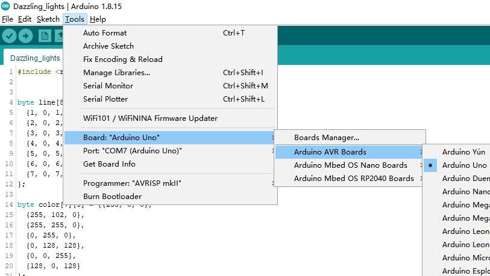
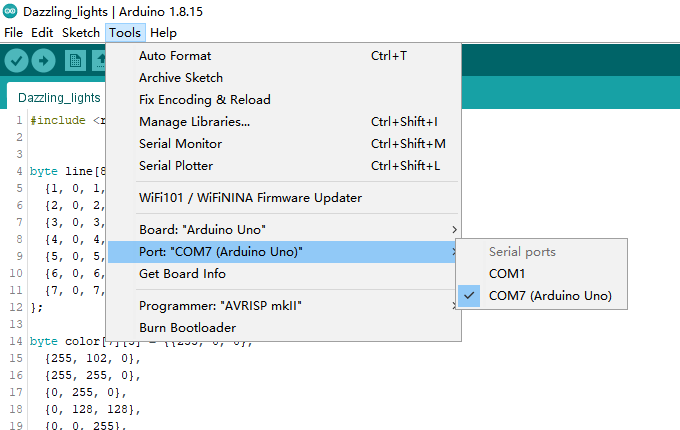
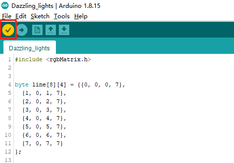
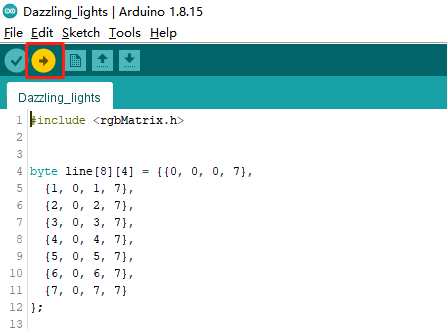
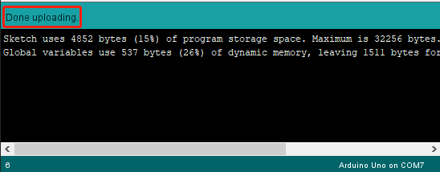

Projects
===========

This page show you the examples provided with RGB Matrix.

.. note::
    Before downloading the code, make sure you have :ref:`Add the Library`.

.. toctree::
    :maxdepth: 1
	
    hello_matrix_arduino
    dazzling_lights_arduino
    moving_eye_arduino
    christmas_tree_arduino
    custom_shape_arduino
    custom_dynamic_shape_arduino	

**Run the sketch**

1. Open the one sketch under the path ``rgb_matrix\arduino``.

2. Select the Board and Port.

3. Compile.

4. Upload.

