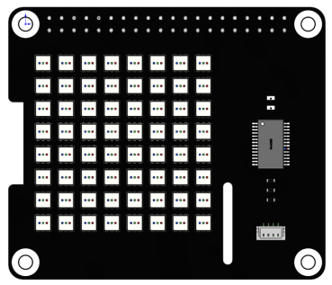

Features
===========

* Working voltage: DC 3.3V
* Lamp bead: FM-N3535RGBW-SH
* Driver: SLED 1734X LED driver
* Communication method: I2C
* Color depth: 24 bit (R/G/B each 8 bit color, 256 x 256 x 256=16777216 colors can be combined)
* Resolution: 8*8=64 DOTS
* Pixel pitch: 4.7mm
* matrix size: 36.5mm*36.5mm

Follow the steps below and you will be able to use RGB Matrix immediately.