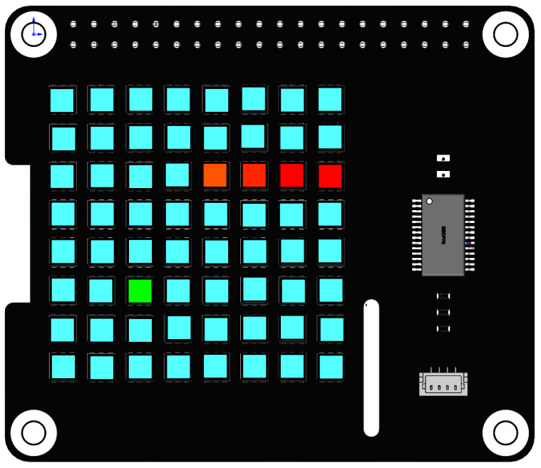
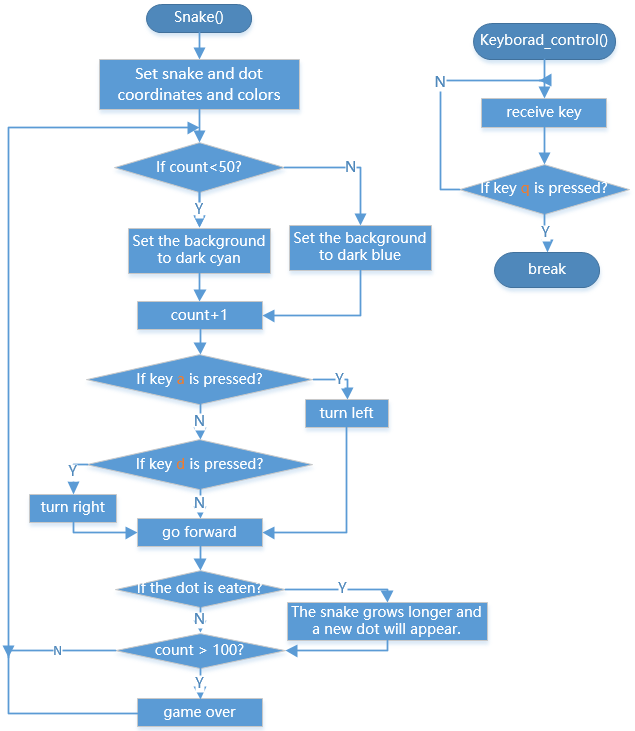

Greedy Snake
===============

In this project, we use the RGB matrix HAT as the display screen to create a snake eating game by reading the values of the keyboard keys to change the display effect.

**Run the code**

When the program runs, the snake game starts, the keyboard ``a`` and ``d`` controls the snake to turn left and right. 
Each time the snake eats a bean, score plus one. When it encounters itself, the score returns to zero. 
After a period of time, the screen will turn blue, and the score will be displayed after a while. Press ``q`` to end the game, and ``Ctrl+C`` to exit the program.

.. raw:: html

    <run></run>

.. code-block::

    cd /home/pi/rgb_matrix/raspberrypi
    sudo python3 snake_game.py  

**Code**

You can view the code by typing the command ``nano snake_game.py`` in Terminal or by clicking on `github-snake_game.py <https://github.com/sunfounder/rgb_matrix/blob/master/raspberrypi/snake_game.py>`_.

**How it works?**

.. code-block:: python

    def readchar():
        fd = sys.stdin.fileno()
        old_settings = termios.tcgetattr(fd)
        try:
            tty.setraw(sys.stdin.fileno())
            ch = sys.stdin.read(1)
        finally:
            termios.tcsetattr(fd, termios.TCSADRAIN, old_settings)
        return ch

This function is used to read keyboard input and return the entered characters.

.. code-block:: python

    def Keyboard_control():
        while True:
            
            global power_val,key
            # key = 'n'
            key=readkey()
            time.sleep(0.22)
            if key=='q':
                print("quit")  
                break  

``Keyboard_control()`` is used for keyboard control. Call ``readkey()`` in an infinite loop to receive the characters input by the keyboard. In addition, the logic of snake-eating is also an infinite loop, then multithreading may be needed when there are multiple infinite loops in a program.

.. code-block:: python

    def snake_game():
        global key
        rr = RGB_Matrix(0X74)
        rectangle_coor = [0,0,7,7]
        #rr.draw_rectangle(rectangle_coor,fill=(51,51,0))   #draw a rectangle
        coor_1 = np.asarray([0,2])
        coor_2 = np.asarray([1,2])
        coor_3 = np.asarray([2,2])
        coor_4 = np.asarray([3,2])
        coor_list = [coor_1,coor_2,coor_3,coor_4]
        ...

``snake_game()`` is used to represent snake-eating logic. The received ``key`` value is a character entered by the keyboard, which needs to be declared as a global variable with ``globla``.

There are three main parts of snake logic:

* In the first part, when the ``a`` or ``d`` key is not pressed, first judge the horizontal and vertical, and then judge the forward direction, and then add 1 or subtract 1 to the horizontal or vertical coordinates of each point to achieve the effect of moving up, down, left, and right.

* The second part is to judge whether the ``a`` or ``d`` key is pressed. If yes, then judge the horizontal and vertical direction and then determine the forward direction, and then add one or subtract one to the coordinates of each point of the snake head, and the snake head coordinates are additionally processed to achieve the effect of turning the head.

* The third part is to determine whether the snake head is in contact with dot. If yes, set ``eat_flag`` to ``False`` and add an element to the list of snakes to achieve the effect of growing snakes.

.. code-block:: python

    if __name__ == "__main__":
        t1 = threading.Thread(target=Keyborad_control)
        t2 = threading.Thread(target=snake_game)
        t1.setDaemon(True)
        t2.setDaemon(True)
        t1.start()
        t2.start()
        while True:
            pass

The ``Thread`` method in the ``threading ``class can help us create a thread, and the parameter is ``target=function name``. 

* ``SetDaemon(True)`` sets the thread as a daemon thread. It is generally used in an unimportant thread with an infinite loop. 
* ``Start()`` starts the thread.