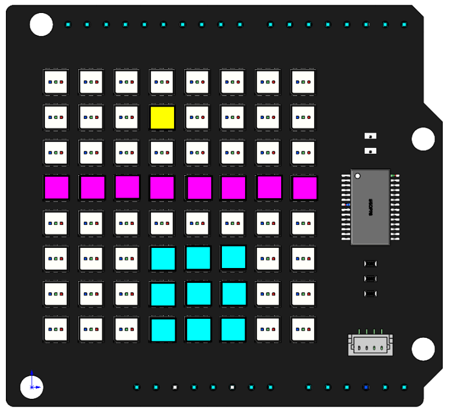
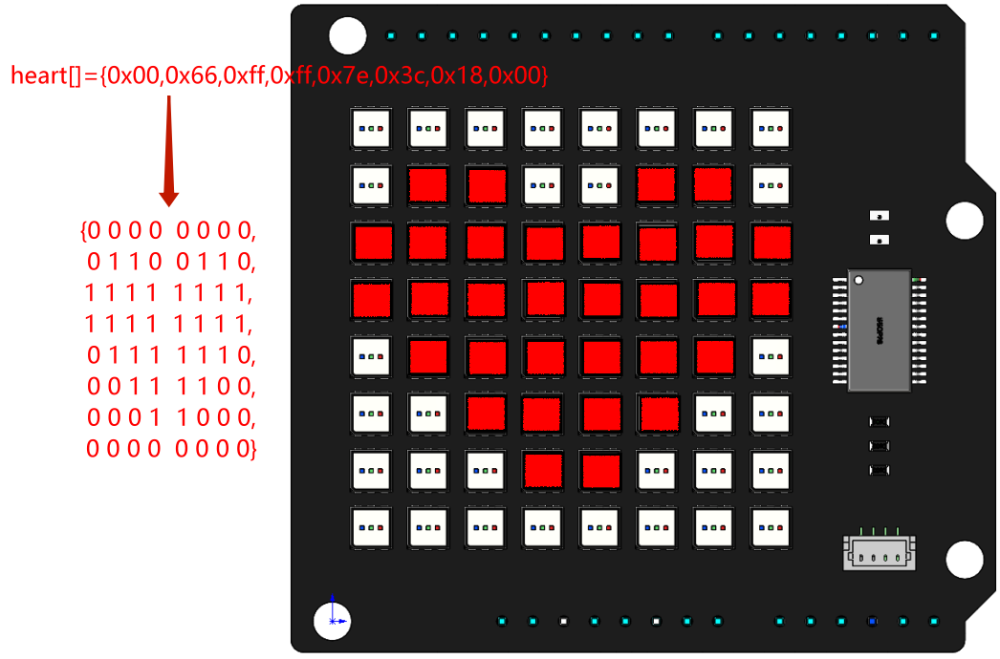

.. _hello_matrix_arduino:

Hello Matrix
===============

**Introduce**

In this project, you will learn how to make RGB Matix HAT display different patterns and characters in different colors.

**Code**

When the program runs, you will see a dot, a line, a rectangle, a love pattern, the letter A, and the text Hi, SunFouder appear on the RGB Matrix Shield in turn.

.. raw:: html

    <iframe src=https://create.arduino.cc/editor/sunfounder01/bebb0645-ff22-4243-9ff3-ba6cd98cf492/preview?embed style="height:510px;width:100%;margin:10px 0" frameborder=0></iframe>

**How it works?**

.. code-block:: arduino

    RGBMatrixInit();

This function is used to initialize the RGB Matrix Shield. To make the RGB Matrix Shield work, you need to call this function first.   

.. code-block:: arduino

    byte dot[2]={3,1};
    byte line[4]={0,3,7,3};
    byte rectangle[4]={3,5,5,7};
    byte heart[]={0x00,0x66,0xff,0xff,0x7e,0x3c,0x18,0x00};

* ``dot[2]={3,1}``: Define an array to store the coordinates of the point (3,1).

* ``line[4]={0,3,7,3}``: Define an array to store the start (0,3) and end (7,3) coordinates of the line.

* ``rectangle[4]={3,5,5,7}``: Define an array to store the two diagonal coordinates (3, 5) and (5, 7) of the rectangle.

* ``heart[]``: This is a hexadecimal array that stores the heart pattern, and each hex digit stores the LED lit or off state for each row. For example, the second element in ``heart[]``, 0x66 (0110 0110), 0 means off and 1 means on, so you can see that the 1st, 2nd, 5th, and 6th are lit and the other LEDs are off.

The x,y coordinate directions of the dot matrix are as follows, with the first RGB LED in the upper left corner as the coordinate origin.

    .. image:: img/hello1.png
        :width: 500

.. code-block:: arduino

    draw_point(dot, 255, 255, 0);
    image();
    delay(3000);
    draw_line(line, 255, 0, 255);
    image();
    delay(3000);
    draw_rectangle(rectangle, 0, 255, 255);
    image();
    delay(3000);
    ShowHex(heart, 255, 0, 0);
    delay(3000);
    DispShowChar('A', 0, 255, 0);
    delay(3000);
    flow_text("Hi, SunFounder", 0, 0, 255);
    delay(3000);

We have packaged six basic functions in the RGB Matrix Shield library.

* ``draw_point(dot,255,255,0)``：It is used to draw a yellow point on the RGB Matrix Shield. It has four parameters. ``dot`` is an array to store the coordinates of the points. 255, 255, 0 represent to fill this point with yellow. Reference: https://www.rapidtables.com/web/color/RGB_Color.html for more color value combinations.

* ``draw_line(line,255,0,255)``: Draw a magenta line.

* ``draw_rectangle(rectangle,0,255,255)``: Draw a cyan rectangle.

.. note::
    ``draw_point()``, ``draw_line()``, ``draw_rectangle()`` just confirm the coordinates of the LEDs that need to be lit, and cooperate with the ``image()`` function to actually light them.

* ``ShowHex(heart,255,0,0)``: Show a red ``heart`` on the RGB Matrix Shield.

``ShowHex`` converts hexadecimal numbers into binary numbers, then judges the binary numbers, and when one of them is equal to 1, it will light up the corresponding LED, as shown below.

Reference: https://gurgleapps.com/tools/matrix#tp-color can get more such hex arrays.

* ``DispShowChar('A',0,255,0)``: Let the RGB Matrix Shield display a green character A.

* ``flow_text("Hi!Sunfounder",0,0,255)``: Let the RGB matrix shield display a string of blue text \"Hi, SunFounder\".

.. note::
    Characters are represented by single quotation marks, and strings are represented by double quotation marks.

