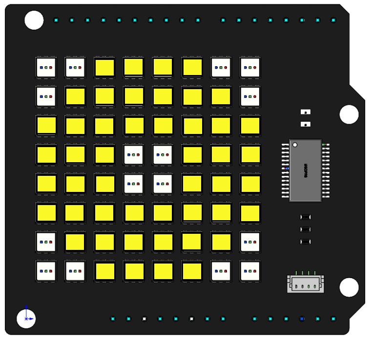

Moving Eye
==============

**Introduce**

In this project, we will use the ``draw_rectangle()`` and ``draw_point()`` functions to draw an eye pattern and achieve the effect of moving the eye around.

**Code**

When the program is running, you will see an eye moving around on the RGB Matrix Shield.

.. raw:: html

  <iframe src=https://create.arduino.cc/editor/sunfounder01/2368c167-9f90-475b-9458-d28c5f62e4d2/preview?embed style="height:510px;width:100%;margin:10px 0" frameborder=0></iframe>
  
**How it works?**

.. code-block:: arduino 

    byte eye[] = {3,3,4,4};
    byte rectangle_arry[] = {0,0,7,7};
    byte point_arry[][2] = {{0,0},{1,0},{0,1},{6,0},{7,0},{7,1},
                       {0,6},{0,7},{1,7},{7,6},{7,7},{6,7}};

The array ``eye[]`` represents the coordinates of the pupil, the array ``rectangle_arry[]`` represents the entire RGB Matrix Shiled, and the array ``point_arry[][2]`` to represent twelve points in the corners, by means of these 3 array to outline the shape of an eye.

.. code-block:: arduino

    void setup() {
      // put your setup code here, to run once:
      RGBMatrixInit();
      draw_rectangle(rectangle_arry,251,248,40);
      for (int i=0; i<sizeof(point_arry); i++){
        draw_point(point_arry[i],0,0,0);  
      }
      draw_rectangle(eye,0,0,0);
      image();
    }

In the ``setup()`` function, the entire RGB matrix is lit in yellow, and then the four corner and pupil position LEDs are extinguished so that you can see an eye.

.. code-block:: arduino

    void loop() {
      // put your main code here, to run repeatedly:
      up(eye,3);
      delay(100);
      down(eye,6);
      delay(100);
      up(eye,6);
      delay(100);
      down(eye,6);
      delay(100);
      up(eye,3);
      delay(1000);
      right_down(eye,2);
      delay(100);
      up(eye,4);
      delay(100);
      left(eye,4);
      delay(100);
      down(eye,4);
      delay(100);
      right(eye,4);
      delay(100);
      left_up(eye,2);
      delay(1000);
    } 

The main loop is to make the eyeball keep moving up and down, then turn one cycle, and finally return to the original position.

We call some functions to move the eyeball, for example ``up(eye,3)`` is to move the eyeball up three squares, now look at how this function is implemented.

.. code-block:: arduino

  void up(byte eye[4],int count=1){
    for (int i=0; i<count; i++){
      draw_rectangle(eye,251,248,40);
      eye[1] -= 1;
      eye[3] -= 1;
      draw_rectangle(eye,0,0,0);
      for (int i=0; i<sizeof(point_arry); i++){
        draw_point(point_arry[i],0,0,0);  
      }
	  image();
      delay(30);  
    }
  }

The ``up()`` function has 2 parameters ``eye[4]`` and ``count``, the internal logic is to move the rectangle ``eye[4]`` up ``count`` squares. (default is 1).

* Define a ``for()`` loop with the number of loops determined by ``count``. 
* Set the color of the rectangle ``eye`` to yellow.
* ``byte eye[] = {3,3,4,4};`` are the 2 diagonal coordinates (3,3) and (4,4), ``eye[1]`` and ``eye[3]`` are subtracted by one, meaning that the y-values of the 2 diagonal coordinates are subtracted by one.
* Then the modified ``eye = [3,2,4,3]`` color is set to (0,0,0) by the function ``draw_rectangle()`` and displayed on the dot matrix by the function ``display()``.
* The second ``for()`` loop is to keep the 12 points on the 4 corners off all the time.
* After one for loop in this way, the pupil is moved up one square.
