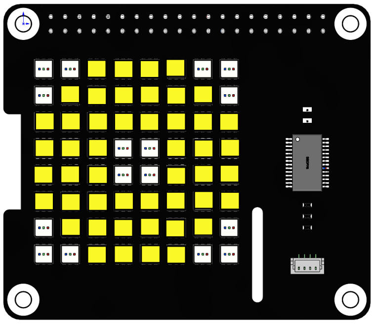

Moving Eye
==============

In this project, we will use the ``draw_rectangle()`` and ``draw_point()`` functions to draw an eye pattern and achieve the effect of moving the eye around.

**Run the code**

When the program is running, you will see an eye moving around on the RGB matrix HAT.

.. raw:: html

    <run></run>

.. code-block::

    cd /home/pi/rgb_matrix/raspberrypi
    sudo python3 moving_eyes.py  

**Code**

.. note::
    You can **Modify/Reset/Copy/Run/Stop** the code below. But before that, you need to go to source code path like ``rgb_matrix/raspberrypi``. After modifying the code, you can run it directly to see the effect.

.. raw:: html

    <run></run>

.. code-block:: python

    from rgb_matrix import RGB_Matrix
    import time

    def up(list,step=1):
        for i in range(0,step):
            rr.draw_rectangle(list,fill=(251,248,40))	
            list[1] -= 1
            list[3] -= 1
            rr.draw_rectangle(list,fill=(0,0,0))
            rr.display()

    def down(list,step=1):
        for i in range(0,step):
            rr.draw_rectangle(list,fill=(251,248,40))
            list[1] += 1
            list[3] += 1
            rr.draw_rectangle(list,fill=(0,0,0))
            rr.display()

    def left(list,step=1):
        for i in range(0,step):
            rr.draw_rectangle(list,fill=(251,248,40))
            list[0] -= 1
            list[2] -= 1
            rr.draw_rectangle(list,fill=(0,0,0))
            rr.display()

    def right(list,step=1):
        for i in range(0,step):
            rr.draw_rectangle(list,fill=(251,248,40))	
            list[0] += 1
            list[2] += 1
            rr.draw_rectangle(list,fill=(0,0,0))
            rr.display()

    def left_down(list,step=1):
        for i in range(0,step):
            rr.draw_rectangle(list,fill=(251,248,40))
            list[0] -= 1
            list[2] -= 1	
            list[1] += 1
            list[3] += 1
            rr.draw_rectangle(list,fill=(0,0,0))
            rr.display()

    def left_up(list,step=1):
        for i in range(0,step):
            rr.draw_rectangle(list,fill=(251,248,40))
            list[0] -= 1
            list[2] -= 1
            list[1] -= 1
            list[3] -= 1	
            rr.draw_rectangle(list,fill=(0,0,0))
            rr.display()

    def right_up(list,step=1):
        for i in range(0,step):
            rr.draw_rectangle(list,fill=(251,248,40))	
            list[0] += 1
            list[2] += 1
            list[1] -= 1
            list[3] -= 1	
            rr.draw_rectangle(list,fill=(0,0,0))
            rr.display()
        
    def right_down(list,step=1):
        for i in range(0,step):
            rr.draw_rectangle(list,fill=(251,248,40))	
            list[0] += 1
            list[2] += 1
            list[1] += 1
            list[3] += 1	
            rr.draw_rectangle(list,fill=(0,0,0))
            rr.display()	

    if __name__ == "__main__":
        rr = RGB_Matrix(0X74)

        rectangle_coor = [0,0,7,7]
        rr.draw_rectangle(rectangle_coor,fill=(251,248,40))

        point_arry = [[0,0],[1,0],[0,1],[6,0],[7,0],[7,1],[0,6],[0,7],[1,7],[7,6],[7,7],[6,7]]
        for i in range(len(point_arry)):
            rr.draw_point(point_arry[i],fill=(0,0,0))

        list = [3,3,4,4]
        rr.draw_rectangle(list,fill=(0,0,0),outline=None, width=0)

        rr.display()
        while True:
            up(list,3)
            down(list,6)
            up(list,6)
            down(list,6)
            up(list,3)
            time.sleep(1)
            right_down(list,2)
            up(list,4)
            left(list,4)
            down(list,4)
            right(list,4)
            left_up(list,2)
            time.sleep(1)	

**How it works?**

.. code-block:: python

    rectangle_coor = [0,0,7,7]
    rr.draw_rectangle(rectangle_coor,fill=(251,248,40))

    point_arry = [[0,0],[1,0],[0,1],[6,0],[7,0],[7,1],[0,6],[0,7],[1,7],[7,6],[7,7],[6,7]]
    for i in range(len(point_arry)):
        rr.draw_point(point_arry[i],fill=(0,0,0))

    list = [3,3,4,4]
    rr.draw_rectangle(list,fill=(0,0,0),outline=None, width=0)

    rr.display()
    

* The list ``rectangle_coor`` represents a rectangle (the whole RGB dot matrix) from coordinates (0, 0) to (7, 7), and then use the ``draw_rectangle()`` function to fill this rectangle with yellow.
* The list ``point_arry`` represents the 12 points in the four corners, then use the ``draw_point()`` function to set the color of each point to (0, 0, 0), i.e., extinguish these points. This depicts the outline of an eye.
* The ``list`` represents a small rectangle from (3, 3) to (4, 4), and then use the ``draw_rectangle()`` function to set the color of this rectangle to (0, 0, 0) to make the rectangle go out. This will describe the outline of the eyeball.
* Finally, the eye pattern is displayed on the RGB Matrix HAT using the ``display()`` function.

.. code-block:: python

    while True:
        up(list,3)
        down(list,6)
        up(list,6)
        down(list,6)
        up(list,3)
        time.sleep(1)
        right_down(list,2)
        up(list,4)
        left(list,4)
        down(list,4)
        right(list,4)
        left_up(list,2)
        time.sleep(1)    

The main loop is to make the eyeball keep moving up and down, then turn one cycle, and finally return to the original position.

We call some functions to move the eyeball, for example ``up(list,3)`` is to move the eyeball up three squares, now look at how this function is implemented.

.. code-block:: python

    def up(list,step=1):
        for i in range(0,step):
            rr.draw_rectangle(list,fill=(251,248,40))	
            list[1] -= 1
            list[3] -= 1
            rr.draw_rectangle(list,fill=(0,0,0))
            rr.display()

The ``up()`` function has 2 parameters ``list`` and ``step``, the internal logic is to move the rectangle ``list`` up ``step`` squares (default is 1).

* Define a ``for()`` loop with the number of loops determined by ``step``. In the ``for()`` loop, set the color of the rectangle ``list`` to yellow.
* ``list = [3,3,4,4]`` are the 2 diagonal coordinates (3,3) and (4,4), ``list[1]`` and ``list[3]`` are subtracted by one, meaning that the y-values of the 2 diagonal coordinates are subtracted by one.
* Then the modified ``list = [3,2,4,3]`` color is set to (0,0,0) by the function ``draw_rectangle()`` and displayed on the dot matrix by the function ``display()``.
* After one for loop in this way, the pupil is moved up one square.

