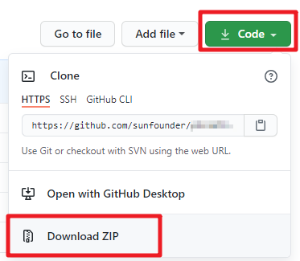
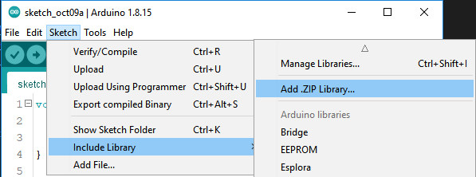
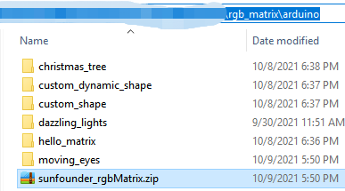

Preparation
===============================

Tools needed
-----------------

Please prepare the following tools:

* Arduino UNO
* USB Cable Type A/B
* Personal Computer

The APP you have to prepare:

* `Arduino IDE <https://www.arduino.cc/en/software>`_

Here are tutorials for installing Arduino on different systems.

* `Windows OS <https://www.arduino.cc/en/Guide/Windows>`_.
* `Mac OS <https://www.arduino.cc/en/Guide/macOS>`_.
* `Linux <https://www.arduino.cc/en/Guide/Linux>`_.

Download the Code
---------------------

Go to `github-rgb_matrix <https://github.com/sunfounder/rgb_matrix>`_ download the code.

Add the Library
--------------------

In order to use the RGB Matrix Shield, you need to load the library as follows.

In the Arduino IDE, navigate to **Sketch** > **Include Library** > **Add .ZIP Library**.

Find ``sunfounder_rgbMatrix.zip`` under the path ``rgb_matrix/arduino``, then click **Open** to add it.

