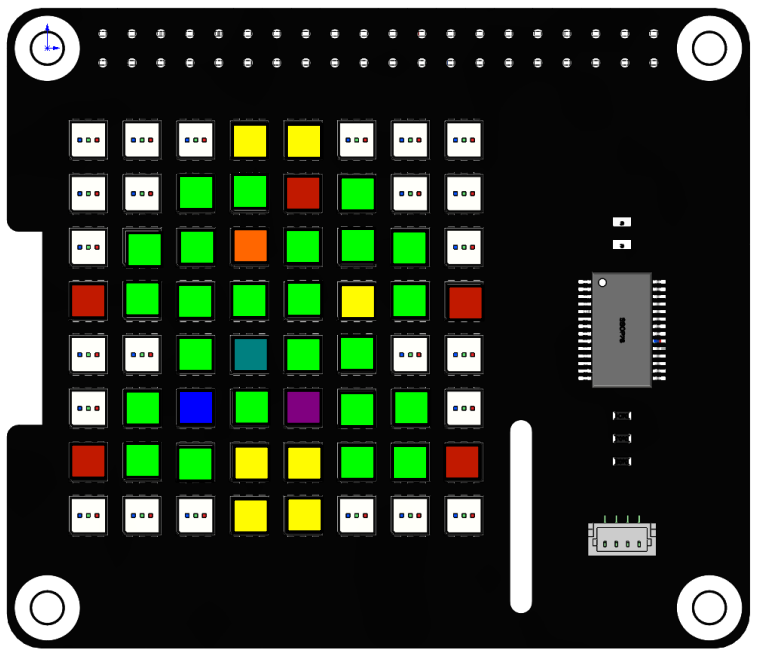

Christmas Tree
===================

In this project, we will use the ``draw_point()`` function to make a colorful Christmas tree.

**Run the code**
 
When the program runs, you will see a shiny Christmas tree appear on the RGB Matrix HAT.

.. raw:: html

    <run></run>

.. code-block::

    cd /home/pi/rgb_matrix/raspberrypi
    sudo python3 christmas_tree.py  

**Code**

.. note::
    You can **Modify/Reset/Copy/Run/Stop** the code below. But before that, you need to go to source code path like ``rgb_matrix/raspberrypi``. After modifying the code, you can run it directly to see the effect.

.. raw:: html

    <run></run>

.. code-block:: python

    from rgb_matrix import RGB_Matrix
    import time
    from color import Color

    def tree():
        
        for i in green_coor:		
            rr.draw_point(i,(0,255,0))
            
        for i in yellow_coor:
            rr.draw_point(i,(255,255,0))	
        
        for i in red_coor:		
            rr.draw_point(i,(255,0,0))
            
        rr.display()

        
    def dot():
        col = Color()

        for i in flash_coor:
            rr.draw_point(i,col.random())
        rr.display()
        
        
    if __name__ == "__main__":
        rr = RGB_Matrix(0X74)

        rectangle_coor = [0,0,7,7]

        green_coor = [[3,0],[4,0],
                [2,1],[3,1],[5,1],
                [1,2],[2,2],[4,2],[5,2],[6,2],
                [1,3],[2,3],[3,3],[4,3],[6,3],
                [2,4],[4,4],[5,4],
                [1,5],[3,5],[5,5],[6,5],
                [1,6],[2,6],[3,6],[4,6],[5,6],[6,6]
                ]	

        flash_coor = [[4,1],[3,2],[5,3],[3,4],[2,5],[4,5]]
        red_coor = [[0,3],[7,3],[0,6],[7,6]]
        yellow_coor = [[3,0],[4,0],[3,6],[4,6],[3,7],[4,7]]	
                    
        tree()
        while True:		
            dot()	

**How it works?**

.. code-block:: python

    from color import Color

Import the color class ``Color``, which is a class that we encapsulate to manipulate RGB Matrix HAT colors. In this project, we will use a class function ``random()`` to display random colors.

.. code-block:: python

    green_coor = [[3,0],[4,0],
            [2,1],[3,1],[5,1],
            [1,2],[2,2],[4,2],[5,2],[6,2],
            [1,3],[2,3],[3,3],[4,3],[6,3],
            [2,4],[4,4],[5,4],
            [1,5],[3,5],[5,5],[6,5],
            [1,6],[2,6],[3,6],[4,6],[5,6],[6,6]]	

    flash_coor = [[4,1],[3,2],[5,3],[3,4],[2,5],[4,5]]
    red_coor = [[0,3],[7,3],[0,6],[7,6]]
    yellow_coor = [[3,0],[4,0],[3,6],[4,6],[3,7],[4,7]]
	
Divide the Christmas tree into four parts, the red part, the yellow part, the green part, and the blinking part, so we need four lists to store these coordinates.

.. code-block:: python

    def tree():
        
        for i in green_coor:		
            rr.draw_point(i,(0,255,0))
            
        for i in yellow_coor:
            rr.draw_point(i,(255,255,0))	
        
        for i in red_coor:		
            rr.draw_point(i,(255,0,0))
            
        rr.display()

Define a ``tree()`` function to draw the green(0, 255, 0), yellow(255, 255, 0) and red(255, 0, 0) parts of the Christmas tree.

.. code-block:: python

    def dot():
        col = Color()

        for i in coor:
            rr.draw_point(i,col.random())
        rr.display()

For the blinking points in the Christmas tree, we can use the ``random()`` function in the ``Color`` class to achieve. The function of ``random()`` is to return a random RGB value, that is, to display random colors in a loop to achieve a blinking effect.

.. code-block:: python

    tree()
    while True:		
        dot()	
	
Finally, two functions are called to draw the Christmas tree. The blinking is continuous, so ``dot()`` should be called in the loop.