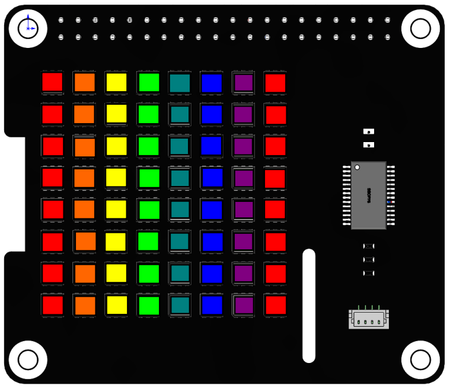

Dazzling Light 
================

In the previous project, we learned to use some simple functions to make RGB Matrix HAT work. So here, we will use the ``draw_line()`` function with different colors to make RGB Matrix HAT make more cool effects.

**Run the code**

As the program runs, you will see the colors on the RGB Matrix HAT changing from right to left.

.. raw:: html

    <run></run>

.. code-block::

    cd /home/pi/rgb_matrix/raspberrypi
    sudo python3 dazzling_lights.py   

**Code**

.. note::
    You can **Modify/Reset/Copy/Run/Stop** the code below. But before that, you need to go to source code path like ``rgb_matrix/raspberrypi``. After modifying the code, you can run it directly to see the effect.

.. raw:: html

    <run></run>

.. code-block:: python

    from rgb_matrix import RGB_Matrix
    import time

    def ColorHSV(hue):

        if hue < 510:  # Red to Green-1
            b = 0
            if hue < 255:  #   Red to Yellow-1
                r = 255
                g = hue  #     g = 0 to 254
            else:  #   Yellow to Green-1
                r = 510 - hue  #     r = 255 to 1
                g = 255

        elif hue < 1020:  # Green to Blue-1
            r = 0
            if hue < 765:  #   Green to Cyan-1
                g = 255
                b = hue - 510  #     b = 0 to 254
            else:  #   Cyan to Blue-1
                g = 1020 - hue  #     g = 255 to 1
                b = 255

        elif hue < 1530:  # Blue to Red-1
            g = 0
            if hue < 1275:  #   Blue to Magenta-1
                r = hue - 1020  #     r = 0 to 254
                b = 255
            else:  #   Magenta to Red-1
                r = 255
                b = 1530 - hue  #     b = 255 to 1

        else:  # Last 0.5 Red (quicker than % operator)
            r = 255
            g = b = 0

        list = [r, g, b]
        return list

    def flash():
        list = [[0, 0, 0, 7], 
                [1, 0, 1, 7], 
                [2, 0, 2, 7], 
                [3, 0, 3, 7],
                [4, 0, 4, 7], 
                [5, 0, 5, 7], 
                [6, 0, 6, 7], 
                [7, 0, 7, 7]]

        firsthue = 0
        hue = 0
        while firsthue < 1530:
            j = 0
            for i in list:
                hue = firsthue + j * 95
                j = j + 1
                if hue > 1530:
                    hue = hue - 1530
                temp = ColorHSV(hue)
                #print(temp[0],temp[1],temp[2])
                #time.sleep(2)
                rr.draw_line(i, (temp[0], temp[1], temp[2]))
            rr.display()
            firsthue = firsthue + 11

    if __name__ == "__main__":
        rr = RGB_Matrix(0X74)

        while True:
            flash()

**How it works?**

In reality, there are three primary colors of red, yellow, and blue, and there are generally three primary colors of red, green, and blue in the display screen, that is, RGB. Their values ​​are generally used
FF0000,00FF00,0000FF means, converted to decimal is (255,0,0),(0,255,0),(0,0,255).
This `website <https://www.rapidtables.com/web/color/RGB_Color.html>`_ can help us better understand the three primary colors.

.. code-block:: python

    def ColorHSV(hue):

        if hue < 510:  # Red to Green-1
            b = 0
            if hue < 255:  #   Red to Yellow-1
                r = 255
                g = hue  #     g = 0 to 254
            else:  #   Yellow to Green-1
                r = 510 - hue  #     r = 255 to 1
                g = 255

        elif hue < 1020:  # Green to Blue-1
            r = 0
            if hue < 765:  #   Green to Cyan-1
                g = 255
                b = hue - 510  #     b = 0 to 254
            else:  #   Cyan to Blue-1
                g = 1020 - hue  #     g = 255 to 1
                b = 255

        elif hue < 1530:  # Blue to Red-1
            g = 0
            if hue < 1275:  #   Blue to Magenta-1
                r = hue - 1020  #     r = 0 to 254
                b = 255
            else:  #   Magenta to Red-1
                r = 255
                b = 1530 - hue  #     b = 255 to 1

        else:  # Last 0.5 Red (quicker than % operator)
            r = 255
            g = b = 0

        list = [r, g, b]
        return list

Reference from `Adafruit_NeoPixel <https://github.com/adafruit/Adafruit_NeoPixel/blob/216ccdbff399750f5b02d4cc804c598399e39713/Adafruit_NeoPixel.cpp#L2414>`_.

Because red is centered on the rollover point (the +32768 above, essentially a fixed-point +0.5), the above actually yields 0 to 1530, where 0 and 1530 would yield the same thing. Rather than apply a costly modulo operator, 1530 is handled as a special case below.

So you'd think that the color "hexcone" (the thing that ramps from pure red, to pure yellow, 
to pure green and so forth back to red, yielding six slices), 
and with each color component having 256 possible values (0-255), 
might have 1536 possible items (6*256), but in reality there's 1530. This is because the last element in 
each 256-element slice is equal to the first element of the next 
slice, and keeping those in there this would create small 
discontinuities in the color wheel. So the last element of each 
slice is dropped...we regard only elements 0-254, with item 255 
being picked up as element 0 of the next slice. Like this: 

* Red to not-quite-pure-yellow is:        255,   0, 0 to 255, 254,   0
* Pure yellow to not-quite-pure-green is: 255, 255, 0 to   1, 255,   0
* Pure green to not-quite-pure-cyan is:     0, 255, 0 to   0, 255, 254
* and so forth. 

Hence, 1530 distinct hues (0 to 1529), and hence why the constants below are not the multiples of 256 you might expect.

.. code-block:: python

    def flash():
        list = [[0,0,0,7],
                [1,0,1,7],
                [2,0,2,7],
                [3,0,3,7],
                [4,0,4,7],
                [5,0,5,7],
                [6,0,6,7],
                [7,0,7,7]]

The list ``list`` stores the starting and ending coordinates of the 8 vertical lines (from left to right), so that each line can be given a different color in the code later to achieve the colorful effect.

.. code-block:: python

    firsthue = 0
    hue = 0	
    while firsthue < 1530:
        j = 0	  
        for i in list:
            hue = firsthue + j*95   
            j = j + 1
            if hue > 1530:
                hue = hue-1530
            temp = ColorHSV(hue)
            rr.draw_line(i,(temp[0],temp[1],temp[2]))
        rr.display()
        firsthue = firsthue + 11

``firshue`` and ``hue`` are passed to ``ColorHSV()`` as parameters.

Define a two-layer loop, the inner for loop is to draw eight lines in eight different colors,
The outer while loop is to add 11 to the ``hue`` values ​​of the eight colors to achieve the effect of color flow.

For example, in the first for loop, 0, 95, 190, 285, 380, 475, 570, 665 are used as the ``hue`` value of the initial color of the 8 lines, and then enter the outer loop to increase the ``hue`` value of each line color by 11 to become 11, 106, 201, 296, 391, 486, 581, 676 to achieve the effect of line color sliding.
