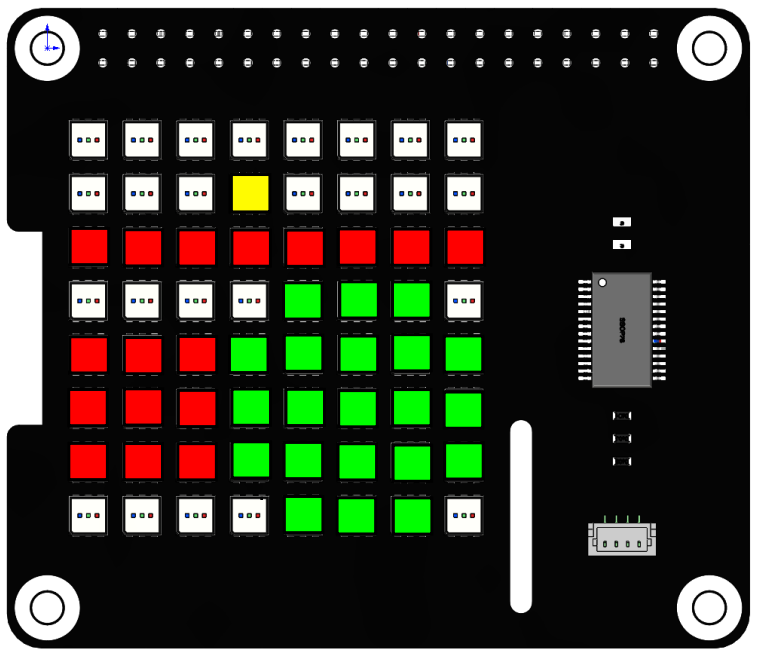
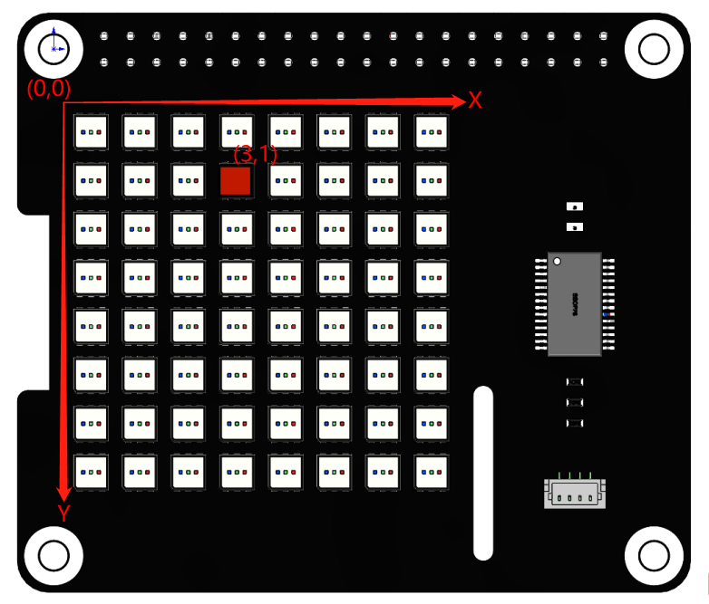

Hello Matrix
===============

In this project, you will learn how to make RGB Matix HAT display different patterns and characters in different colors.

**Run the code**

When the program runs, you will see a point, a line, a rectangle, an ellipse, and the text \'Hi, SunFounder\' appears on the RGB Matrix HAT in turn.

.. raw:: html

    <run></run>

.. code-block::

    cd /home/pi/rgb_matrix/raspberrypi
    sudo python3 hello_matrix.py

**Code**

.. note::
    You can **Modify/Reset/Copy/Run/Stop** the code below. But before that, you need to go to source code path like ``rgb_matrix/raspberrypi``. After modifying the code, you can run it directly to see the effect.

.. raw:: html

    <run></run>

.. code-block:: python

    from rgb_matrix import RGB_Matrix
    import time

    rr = RGB_Matrix(0x74)                     # create an RGB_Matrix object

    point_coor = [3,1]
    rr.draw_point(point_coor,fill=(255,255,0))   #draw a point
    rr.display()
    time.sleep(3)

    line_coor = [0,2,7,2]
    rr.draw_line(line_coor,fill=(255,0,0))  # draw a line
    rr.display()
    time.sleep(3)

    rectangle_coor = [0,4,2,6]
    rr.draw_rectangle(rectangle_coor,fill=(255,0,0))   #draw a rectangle
    rr.display()
    time.sleep(3)

    ellipse_coor = [5,5]
    radius = 2
    rr.draw_ellipse(ellipse_coor,radius,fill=(0,255,0))   #draw a ellipse
    rr.display()  #display the picture which you draw
    time.sleep(3)

    text = 'Hi, SunFounder'
    rr.show_text(text, delay=200,color=(0,0,255))   # show text
    rr.display()
    time.sleep(4)

**How it works?**

.. code-block:: python

    from rgb_matrix import RGB_Matrix
	
    rr = RGB_Matrix(0x74)
	
Import the ``RGB_Matrix`` class, and then create its object ``rr`` for us to call its class member functions.

.. code-block:: python

    point_coor = [3,1]
    rr.draw_point(point_coor,fill=(255,255,0))   #draw a point
    rr.display()
    time.sleep(3)

The above code is to display a yellow dot on the (3,1) coordinate of the RGB dot matrix.

``draw_point()`` is a function that draws a point with 2 parameters: the first parameter is the coordinate on the RGB Matrix HAT, and the second parameter sets the color for the point.

The x,y coordinate directions of the dot matrix are as follows, with the first RGB LED in the upper left corner as the coordinate origin.

The fill tuple contains three elements R, G and B (red, green and blue) in the range 0-255. For example, when ``fill=(255,0,0)``, red is displayed. Refer to: https://www.rapidtables.com/web/color/RGB_Color.html for more color value combinations.

Once the coordinate and color are determined, the ``display()`` function is called to implement on the RGB dot matrix HAT.

.. code-block::	python
	
    line_coor = [0,2,7,2]
    rr.draw_line(line_coor,fill=(255,0,0))  # draw a line
    rr.display()
    time.sleep(3)

The above code draws a red line starting at coordinate (0,2) and ending at (7,2).

``draw_line()`` is a line drawing function, ``line_coor=[0,2,7,2]`` stores the coordinates of the start and end of the line (2 points determine a line). ``fill=(255,0,0)`` represents the line color is red.
	
.. code-block::	python
	
    rectangle_coor = [0,4,2,6]
    rr.draw_rectangle(rectangle_coor,fill=(255,0,0))   #draw a rectangle
    rr.display()
    time.sleep(3)

The above code draws a red rectangle with coordinates (0, 4) and coordinates (2, 6) as diagonal coordinates.

``draw_rectangle()`` is a function that draws a rectangle. The list ``rectangle_coor = [0,4,2,6]`` represents the two diagonal coordinates of the rectangle (0,4) and (2,6). The ``fill=(255,0,0)`` indicates that the rectangle color is red.
	
.. code-block:: python
	
    ellipse_coor = [5,5]
    radius = 2
    rr.draw_ellipse(ellipse_coor,radius,fill=(0,255,0))   #draw a ellipse
    rr.display()  #display the picture which you draw
    time.sleep(3)

The above code draws a green circle with the coordinates (5,5) as the center and a radius of 2.

``draw_ellipse()`` is a function that draws a circle with three arguments that determine the center, radius and color of the circle.

.. code-block::	python
	
    text = 'Hi, SunFounder'
    rr.show_text(text, delay=200,color=(0,0,255))   # show text 
    rr.display()
    time.sleep(4)
	

The above code is to move and display \'Hi, SunFounder\' on the RGB Matrix HAT.

``show_text()`` is used to display text information, ``text`` represents the string to be displayed, ``delay`` represents the moving time, the larger the value, the slower the text moving speed.

